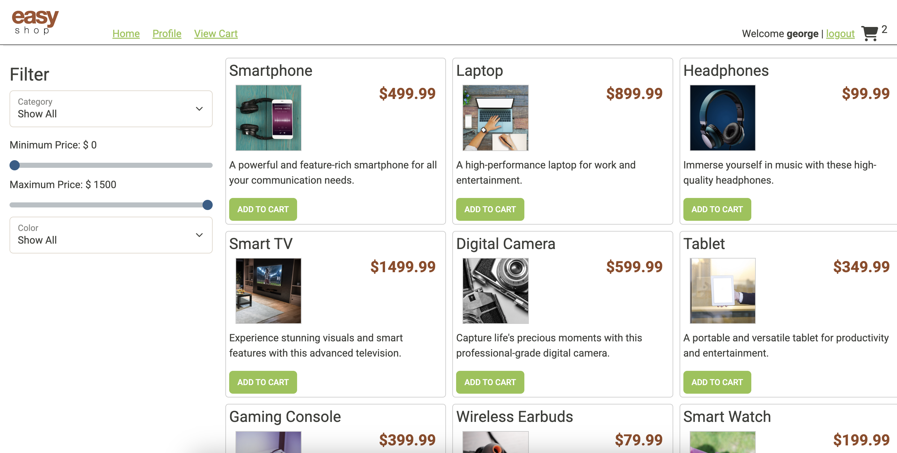
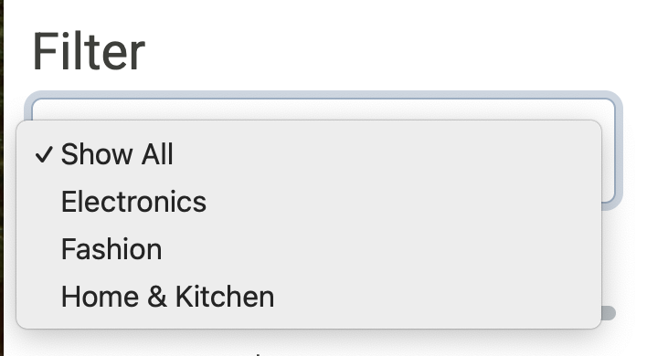
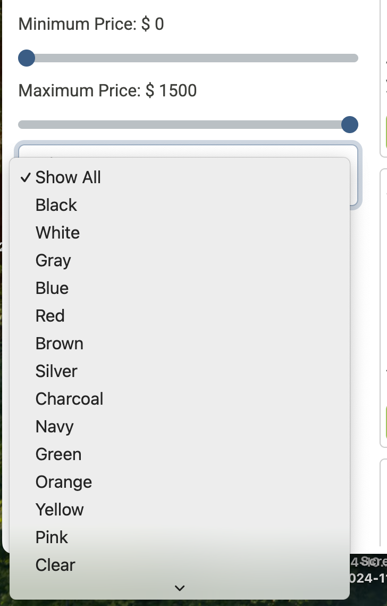
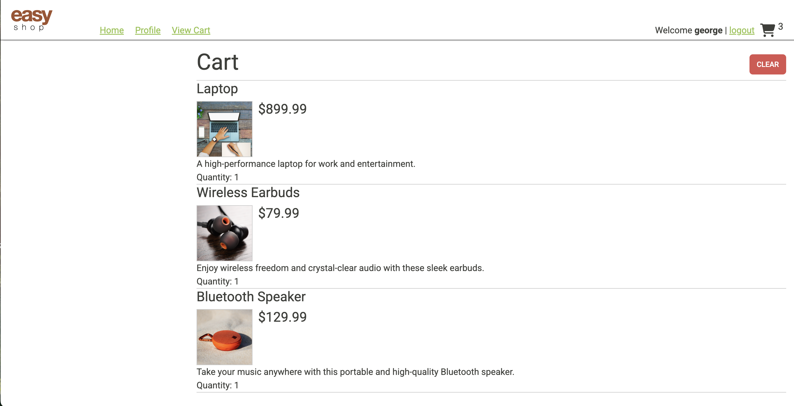
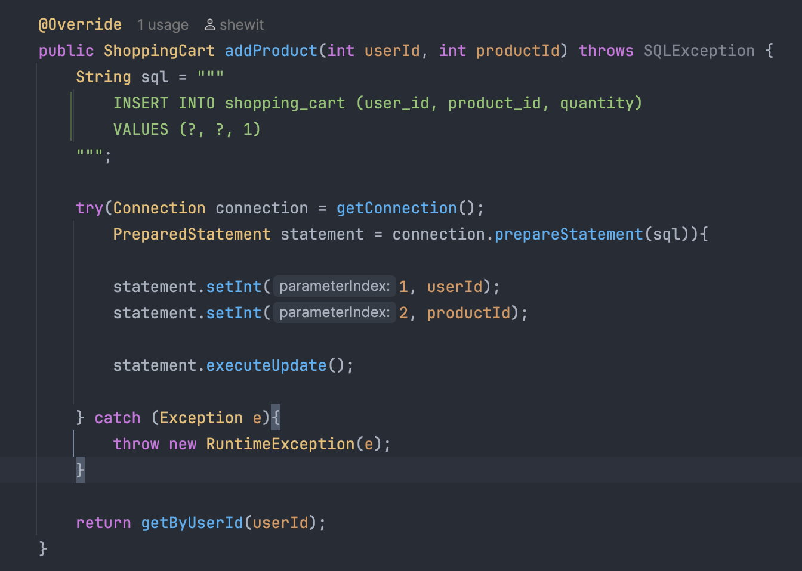
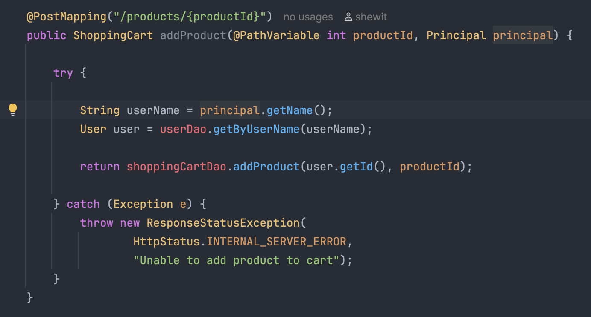

# The E-Commerce API Capstone

My name is **Shewit Hailu**, and I am a student in the **Year Up** program — a national workforce development initiative that helps young adults gain professional and technical skills.

This project is my Application Development Capstone for the Year Up program. I am **Shewit Hailu**, a **Year Up student** currently developing my skills in software engineering and application development.



**The Easy Shop** is an e-commerce web application backed by a Java Spring Boot REST API and a MySQL database. This project focuses on enhancing the backend functionality of an existing online store that sells a wide variety of general goods. I worked within the provided starter code to implement and extend API endpoints that support core shopping features such as browsing products, managing categories, and adding items to a user’s shopping cart.

The application follows a RESTful design and uses a relational database to store product, user, and cart data. All backend logic is tested using Postman to verify correct request handling, data persistence, and error responses. A prebuilt front-end web application is also included to demonstrate how the API integrates with the user interface and to validate end-to-end functionality.

Time spent: **4** days spent in total

## Required Features

The following **required** functionality is completed:

- [x] Implemented a fully functional CategoriesController with RESTful endpoints to retrieve, create, update, and delete product categories
- [x] Enforced role-based access control, allowing only administrators to insert, update, or delete categories and products
- [x] Completed DAO implementations for categories using MySQL
- [x] Exposed REST endpoints to retrieve all categories and individual categories by ID
- [x] Fixed product search functionality to correctly filter results by category, subcategory, and price range
- [x] Resolved product duplication issues by correcting the update logic to properly modify existing products instead of inserting new records


The following **optional** features are half - full Implemented:

- [x] Added full shopping cart functionality for authenticated users
- [x] Users can add products to their cart, update quantities, view cart contents, and clear their cart
- [x] Shopping cart data persists in the database and remains available across user sessions

The following **additional** features are implemented:

- [x] Built and tested all API endpoints using Insomnia
- [x] Integrated Spring Security to restrict access based on user roles
- [x] Used a Spring Boot REST API with a MySQL database for data persistence

### Built With

[![Java][Java.com]][Java-url]


[![Maven][Maven.apache.org]][Maven-url]


[![IntelliJ IDEA][IntelliJ.com]][IntelliJ-url]


[![GitHub][GitHub.com]][GitHub-url]


[Java.com]: https://img.shields.io/badge/Java-ED8B00?style=for-the-badge&logo=openjdk&logoColor=white
[Java-url]: https://www.java.com/


[Maven.apache.org]: https://img.shields.io/badge/Maven-C71A36?style=for-the-badge&logo=apachemaven&logoColor=white
[Maven-url]: https://maven.apache.org/


[IntelliJ.com]: https://img.shields.io/badge/IntelliJ_IDEA-000000?style=for-the-badge&logo=intellij-idea&logoColor=white
[IntelliJ-url]: https://www.jetbrains.com/idea/


[GitHub.com]: https://img.shields.io/badge/GitHub-181717?style=for-the-badge&logo=github&logoColor=white
[GitHub-url]: https://github.com/


## 📝 Notes

**API Data Handling:** Implementing and fixing backend functionality required careful handling of request and response data through RESTful API endpoints. This included validating request parameters, mapping JSON bodies to Java models, and properly handling exceptions to ensure reliable API responses.

**Search & Data Integrity:** Debugging the product search feature required close attention to filtering logic for category, subcategory, and price range queries. Ensuring accurate results and preventing duplicate products during updates highlighted the importance of correct SQL queries and update logic within the DAO layer.

**Code Structure:** Following a layered architecture (Controllers, DAOs, Models) greatly improved maintainability and clarity. Separating concerns between API endpoints, database access, and business logic made the application easier to debug and extend. Leveraging Spring Boot conventions and role-based security helped keep the codebase organized, scalable, and aligned with real-world backend development practices.


## Application Screens

### Home Screen - E-Commerce 


### Filter Screen Feature - E-Commerce


### Search/Color Feature - E-Commerce


### View Cart Screen - E-Commerce



## Interesting Piece of Code
1. One of the most interesting features in my Easy Shop project is the shopping cart add-to-cart functionality. It allows logged-in users to add products to their personal cart, which is stored in the database and tied to their account.
2. This code demonstrates how backend logic connects authentication, database operations, and real-time updates. Each time a product is added, the system associates it with the current user and immediately returns the updated shopping cart, ensuring accurate quantities and a smooth shopping experience.






## Installation

1. Clone the repo
   ```sh
   git clone https://github.com/ShewitH1/EcommerceCapstone-api.git

2. Open the project in IntelliJ IDEA

3. Run EasyShopApplication.java
